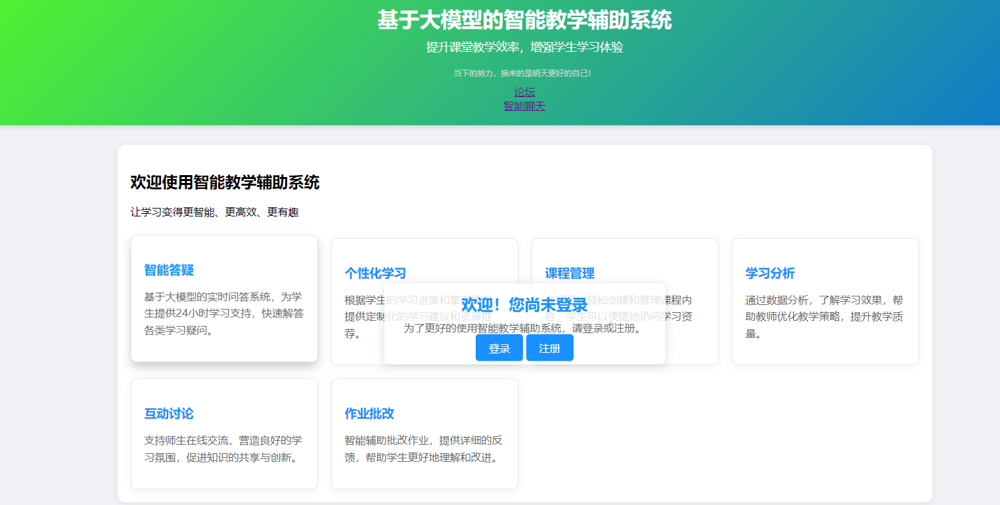

# 项目名称：智能教学辅助系统（ITAS）

## 开发须知
0. **请在自己的文件夹内操作**：qiu：邱硕民 \| xu：许冰冰 \| xie：谢欣怡

1. **功能集成**：需要将新增功能集成到本项目中，确保可以直接运行使用。
2. **代码保护**：不要随意删除他人编写的代码，如需删除请先进行沟通。

## 项目介绍

智能教学辅助系统（ITAS）是一款集成了先进人工智能技术的教育工具。它旨在提升教学质量与效率，为教师和学生提供全方位的辅助教学支持。通过智能化分析、个性化推荐和实时互动等功能，ITAS能够帮助教师更好地管理课程、评估学生学习情况，并为学生提供定制化的学习资源和反馈。
